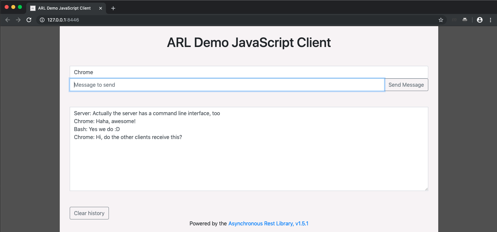

# ARL Demo Application

Just a little hands-on help, to get started with the ARL.

## About

This repository hosts a demo asynchronous REST-backend, internally powered by the [Asynchronous Rest Library (ARL)](https://github.com/kartoffelquadrat/AsyncRestLib). Additionally, there are client-side counterparts.
 * The code here is meant as support for developers who want to use the ARL in their projects.
 * This is not an explanation of the library. For more information, consult the [official README](https://github.com/kartoffelquadrat/AsyncRestLib), or read the [official JavaDocs](https://kartoffelquadrat.github.io/AsyncRestLib/eu/kartoffelquadrat/asyncrestlib/package-summary.html).

## Context

The demo application is a HTTP based chat, consisting of a server and clients in various programming languages.  

### Chat Server

 * Written in Java / Spring-Boot.
   * Messages are "pushed" uniquely over HTTP/REST-endpoints.
   * The server internally uses the [Asynchronous Rest Library (ARL)](https://github.com/kartoffelquadrat/AsyncRestLib).  
   => [Take me to the interesting part of the code](server/src/main/java/eu/kartoffelquadrat/asyncrestdemo/StateController.java)

### Chat clients

 * A HTML / JavaScript chat client. Supports sending and receiving of chat messages per browser. Tested on:
   * Tested on various platforms
     * Safari on iOS / MacOS
     * Firefox on iOS / Android / MacOS
     * Chrome on Android / MacOS  
   * Implicitly powered up together with the server. Accessible at ```http://127.0.0.1:8446/```  
   => [Take me to the interesting part of the code](server/src/main/resources/static/savefetch.js)
        
 * A Bash command line chat client. Composed of two scripts:
   * A bash script for sending messages. (Nothing special here)
   * A bash script for receiving chat messaged asynchronously over HTTP.  
   => [Take me to the interesting part of the code](bashclient/receiver.sh)
   
 * A Java command line chat client.
   * Supports receiving of messages, only.
   * Supports various command line arguments to demonstrate advanced subscription features of the ARL  
   => [Take me to the interesting part of the code](javaclient/src/main/java/eu/kartoffelquadrat/asyncrestdemo/client/LongPollLoop.java)
    
 
## Screenshots
 
### Web-Client
 

 
 
### Bash receiver and sender
 

 
 
### Java receiver
 

 
 
## Try it out
 
To run the demo-application on your system, do the following:
 
 1. Clone this repository: ```git clone https://github.com/kartoffelquadrat/AsyncRestDemo.git```
 2. Go into the downloaded directory and compile the sources: ```cd AsyncRestDemo; mvn clean package```
 3. Power up the server: ```java -jar server/target/server.jar```
 4. Run the clients:
   * Visit [http://127.0.0.1:8446/](http://127.0.0.1:8446/)
   * Run the bash command line clients:
     * bashclient/receiver.sh
     * bashclient/sender.sh
   * Run the Java command line client:  
     ```java -jar javaclient/target/java-receiver.jar```  
     Optional command line arguments:
     * ```-d``` to disable hashed update requests
     * ```tag``` to subscribe only to messages containing a specific String (tag)
 
 
## Contact / Pull Requests
 
 * Author: Maximilian Schiedermeier 
 * Github: Kartoffelquadrat
 * Webpage: https://www.cs.mcgill.ca/~mschie3
 * License: [MIT](https://opensource.org/licenses/MIT)
